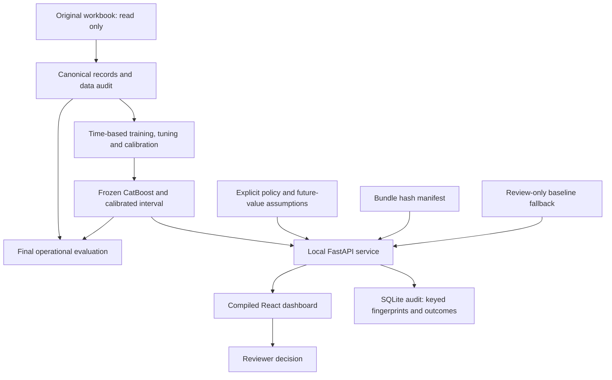

# Recovery Lab architecture

The browser and Python service run on the same computer at port 8078. Model weights, calibration and policy remain frozen. The evidence view uses final holdout reports. Historical lookup continues to expose calibration cases only and labels them accordingly.

The notebook executes the same packaged calculation code in process, independently of the running app. The PowerPoint architecture slide contains editable native diagram objects. The event artwork comes from the uploaded cover template and remains an image.

The local release does not provide organizational authentication, distributed serving or a production underwriting approval. These are pilot gates documented in the executive summary and model card.
